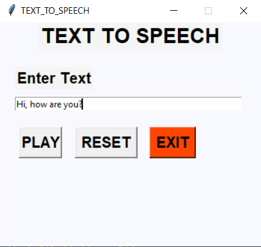

# Text-to-Speech
The objective of this project is to convert the text into voice with the click of a button. This project is developed using the popular Tkinter library for rendering graphics on a display window, gTTs (google text to speech) library to convert text to voice, and playsound library to play that converter voice from the text.

